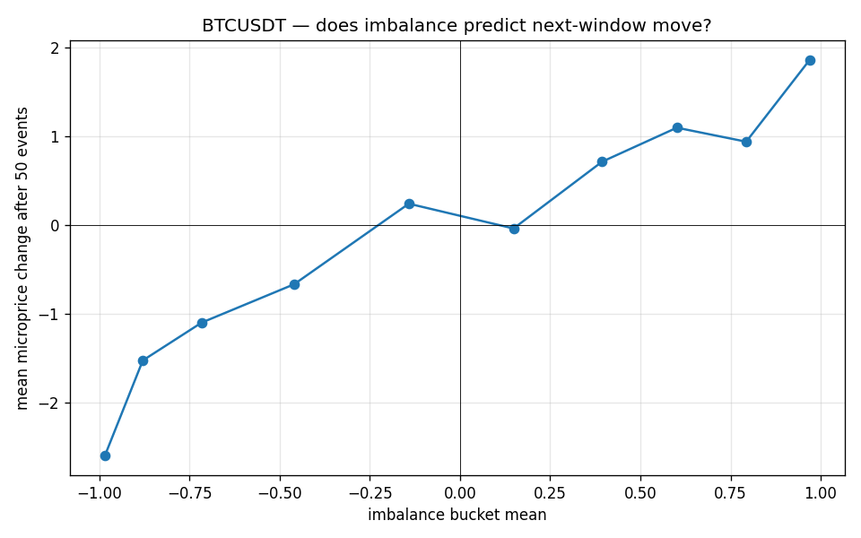
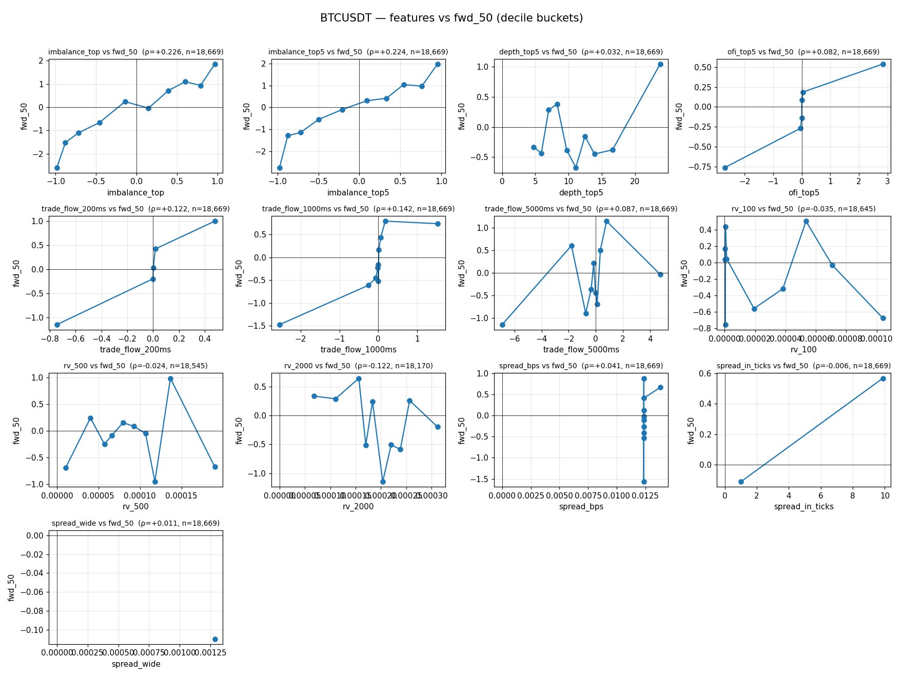
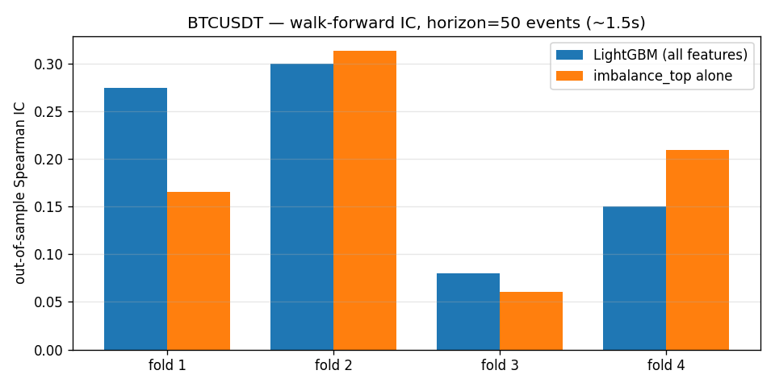
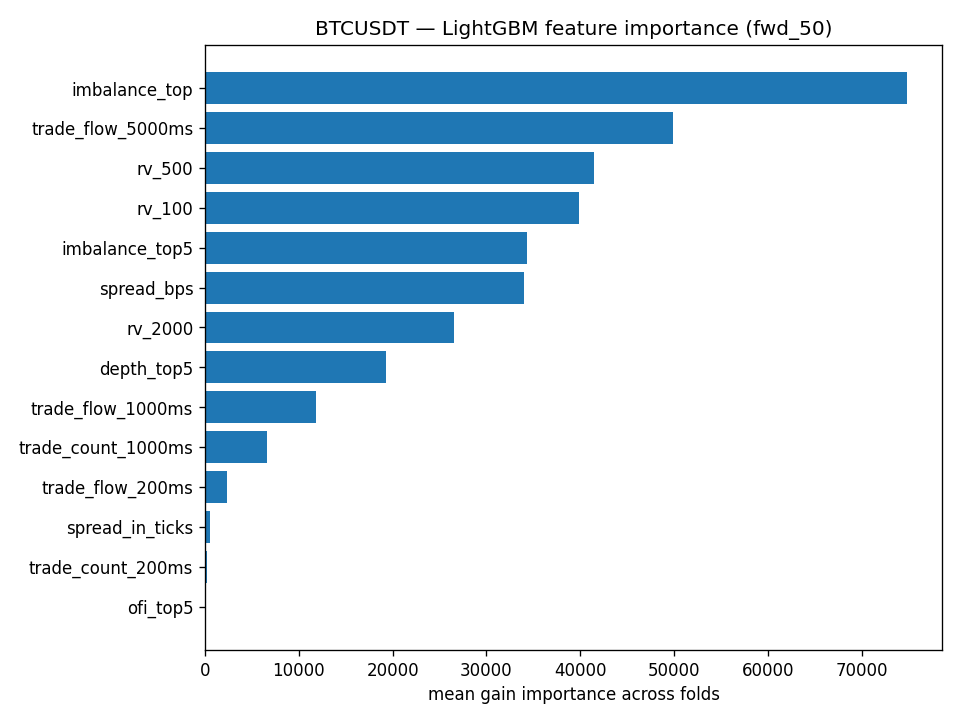

# qr — quant research

Pet-проект для входа в quant/HFT: сбор L2 orderbook + trades, фичи на микроструктуре, бэктест с моделью очереди.

## Stage 1 — collector (текущий этап)

Собирает с **Bybit linear (USDT perpetuals)** через V5 public stream:
- `orderbook.50.{symbol}` — snapshot + delta-обновления топ-50 уровней
- `publicTrade.{symbol}` — каждая исполненная сделка

> Изначально планировался Binance Futures, но `aggTrade` через `fstream.binance.com` с этого IP молча режется (depth идёт, trades — нет, geo-фильтр). Bybit — топ-3 perp-биржа, KZ-friendly, схожая микроструктура. На сервере с другим IP можно вернуться к Binance, поменяв `QR_WS_URL`.

Складывает в parquet (zstd) с разбивкой по символу и часу:

```
data/bybit_linear/{book|trades}/{symbol}/YYYY-MM-DD/HH/{timestamp}.parquet
```

### Data volume (ориентир)

При `book_depth=50` для BTC/ETH/SOL — ~3000 событий за 30с (~100/сек). Прикидка: **~5 GB/день** в zstd-parquet для трёх символов. Если упирается в место — снизить до `QR_BOOK_DEPTH=1` (top-of-book), это в десятки раз меньше.

### Запуск локально

```bash
cd ~/projects/qr
cp .env.example .env   # подправь символы / depth при необходимости
uv run python collector.py
```

Логи раз в минуту показывают rate по каждому стриму. Останавливать — Ctrl+C, final flush сохранит остаток буфера.

### Деплой на Ubuntu+RTX сервер

```bash
git clone <твой-github-url> ~/qr
cd ~/qr
curl -LsSf https://astral.sh/uv/install.sh | sh
uv sync
cp .env.example .env
```

Запуск под systemd — см. `scripts/qr-collector.service`. Скопировать в `/etc/systemd/system/`, поправить `User` и `WorkingDirectory`, затем:

```bash
sudo systemctl daemon-reload
sudo systemctl enable --now qr-collector
sudo journalctl -u qr-collector -f
```

### Проверка собранных данных

```python
import pyarrow.dataset as ds
trades = ds.dataset("data/bybit_linear/trades/btcusdt", format="parquet").to_table()
book = ds.dataset("data/bybit_linear/book/btcusdt", format="parquet").to_table()
print("trades:", trades.num_rows, "book events:", book.num_rows)
```

Schema:
- **trades**: event_time (ms), symbol, trade_id, side (Buy/Sell — taker side), price, qty, tick_direction, is_block_trade, received_at_ns
- **book**: event_time (ms), symbol, update_id, seq, event_type (snapshot|delta), bids_px[], bids_qty[], asks_px[], asks_qty[], received_at_ns

Book даёт **дельты**, не партишн-снапшоты. Для top-N в любой момент времени нужно реконструировать книгу: применять delta-события к последнему snapshot. Это будет в Stage 2.

## Stage 2 — book reconstruction + первая фича (готово)

`book.py` — реконструкция книги из snapshot+delta событий. На каждом событии можно получить top-N состояние (`BookState`) с производными:
- `mid` — `(best_bid + best_ask) / 2`
- `microprice` — объёмно-взвешенная справедливая середина
- `spread`, `imbalance` — для top-of-book

`analyze.py BTCUSDT` — прогон по собранным данным: replay → DataFrame с фичами, summary stats, два графика в `plots/`.

### Первый результат: imbalance предсказывает движение цены

10 минут BTCUSDT, 18.7к book-событий. Делим текущий imbalance на 10 квантильных бакетов, смотрим средний microprice change через следующие 50 событий (~1.6 секунды):



Почти монотонная связь: bid-heavy (+1) → +$1.85 ход, ask-heavy (−1) → −$2.5 ход. Это рабочая микроструктурная фича на сырых данных без всякого ML.

## Stage 2b — расширенный feature set + ranking (готово)

`features.py` — 13 фич на текущий момент:
- top-of-book: `imbalance_top`, `spread`, `spread_bps`, `spread_in_ticks`, `spread_wide`
- multi-level (top-5): `imbalance_top5`, `depth_top5`, `ofi_top5` (Cont-Kukanov-Stoikov order flow imbalance)
- trade flow: signed-volume rolling sums по окнам 200мс / 1с / 5с
- realized volatility: rolling по окнам 100 / 500 / 2000 ивентов

`evaluate.py` — Spearman корреляция каждой фичи с forward microprice change на горизонтах 10 / 50 / 200 / 1000 book-ивентов + bucket-плот для всех в одной сетке.

### Ranking (10 мин BTCUSDT, 18.7к book events)

| Горизонт | Лучшая фича | Spearman ρ |
|---|---|---|
| 10 ивентов (~0.3с) | `ofi_top5` | +0.117 |
| 50 ивентов (~1.5с) | `imbalance_top` | +0.226 |
| 200 ивентов (~6с) | `imbalance_top5` | +0.283 |
| 1000 ивентов (~30с) | `spread_bps` (+) / `rv_2000` (−) | +0.366 / −0.264 |

Канонический результат: OFI рулит на тиковых горизонтах, top-of-book imbalance — на 1-6 секунд, а на 30+ секунд микроструктура уступает место spread/volatility режимам.



## Stage 3 — LightGBM с walk-forward CV (готово)

`model.py` — LightGBM regression на 14 фичах из `features.py`, таргет `fwd_50` (microprice change через 50 book events ≈ 1.5с).

**Walk-forward chronological CV** с эмбарго равным горизонту: train ⊂ [0, T₁ − H), test ⊂ [T₁ + H, T₂). Train-сет растёт монотонно с фолдом. Эмбарго закрывает утечку через перекрывающиеся target-окна (Lopez de Prado).

**Бенчмарк:** в каждом фолде сравниваем модель не только с naive zero, но и с предсказанием по одной фиче `imbalance_top` — чтобы видеть реальный edge от мульти-фича модели.

### Результаты (10 мин BTCUSDT, 18.7к ивентов, 4 фолда по 3.6к)

| Fold | Train | Test | IC LightGBM | IC imbalance_top | best_iter |
|---|---|---|---|---|---|
| 1 | 3,584 | 3,584 | +0.274 | +0.165 | 69 |
| 2 | 7,218 | 3,584 | +0.300 | +0.313 | 8 |
| 3 | 10,852 | 3,584 | +0.080 | +0.060 | 2 |
| 4 | 14,486 | 3,584 | +0.150 | +0.210 | 15 |
| **mean** | | | **+0.201** | **+0.187** | |



**Что видно:**
- OOS IC ≈ +0.2 на 1.5-секундном горизонте — сигнал реальный (random = 0).
- LightGBM едва обходит одну фичу `imbalance_top` (+0.20 vs +0.19) — на 18к ивентов мульти-фича модель не успевает выучить нелинейные эффекты. Нужно 100к+ для нормального edge.
- Огромная вариация по фолдам (0.08 → 0.30) подтверждает «мало данных».



**Feature importance:** `imbalance_top` лидирует, дальше `trade_flow_5000ms`, `rv_500`, `rv_100`, `imbalance_top5`, `spread_bps`. `ofi_top5` — последняя, хотя в Spearman ranking она была лучшей на h=10. Это подтверждает: OFI работает на тиковых горизонтах, для h=50 ей нечего дать.

## Roadmap

- [x] Stage 1: collector
- [x] Stage 2a: book reconstruction + microprice + imbalance (top-of-book)
- [x] Stage 2b: multi-level features + Spearman ranking
- [x] Stage 3: LightGBM walk-forward CV, OOS IC ≈ +0.20 на h=50
- [ ] Stage 4: event-driven backtest с моделью очереди, маркауты (PnL @ 1с/10с/1мин), maker/taker fee + slippage
- [ ] Долгий сбор на сервере (1+ день) → пере-обучение, должно стабилизировать walk-forward результаты
